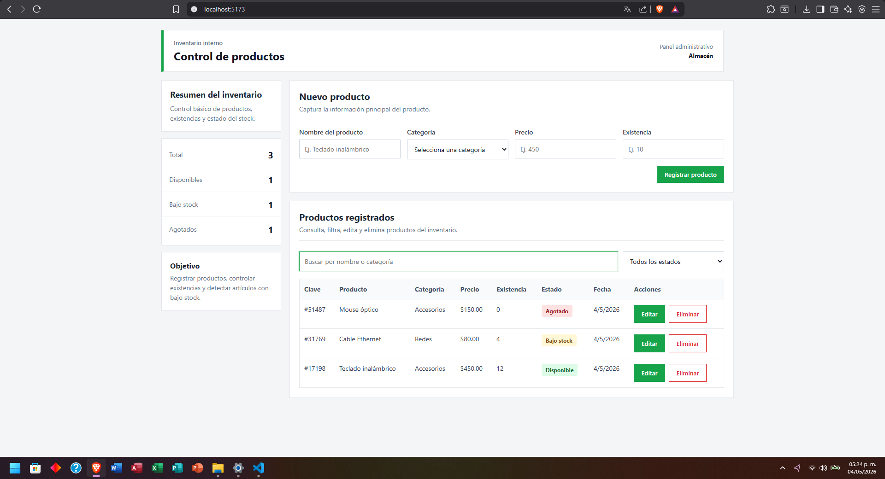

# Sistema de Inventario Web

Aplicación web desarrollada con React para registrar, consultar, editar y eliminar productos de un inventario.

## Descripción del proyecto

Este proyecto fue desarrollado como una simulación de un sistema básico de inventario interno.

La idea surge de la necesidad que tienen muchos negocios o áreas administrativas de llevar un control sencillo de sus productos, existencias y estado del stock. El sistema permite registrar productos, asignarles una categoría, definir su precio, controlar la existencia disponible y clasificar automáticamente su estado como disponible, bajo stock o agotado.

Este proyecto forma parte de mi portafolio como estudiante de Ingeniería en Sistemas Computacionales, con el objetivo de practicar desarrollo frontend, operaciones CRUD, manejo de formularios, filtros, persistencia local y control de versiones con Git y GitHub.

## Captura del sistema

## Funcionalidades

- Registro de productos.
- Edición de productos existentes.
- Eliminación de productos.
- Búsqueda por nombre o categoría.
- Filtro por estado del producto.
- Control de existencias.
- Clasificación automática del estado:
  - Disponible
  - Bajo stock
  - Agotado
- Contadores de productos totales, disponibles, bajo stock y agotados.
- Persistencia de datos usando LocalStorage.

## Tecnologías utilizadas

- React
- JavaScript
- HTML
- CSS
- Vite
- LocalStorage
- Git
- GitHub

## Aprendizajes aplicados

- Creación de una aplicación web con React.
- Manejo de estados con useState.
- Uso de useEffect para guardar información en LocalStorage.
- Uso de useMemo para filtrar información.
- Manejo de formularios.
- Operaciones CRUD.
- Renderizado condicional.
- Diseño responsivo con CSS.
- Control de versiones con Git y GitHub.

## Autor

Ángel Emiliano Reyes Rodríguez  
Estudiante de Ingeniería en Sistemas Computacionales  
Instituto Tecnológico de Iguala